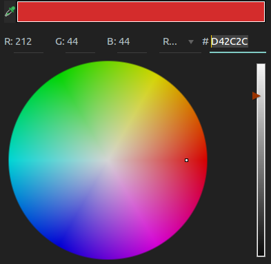

# Projet-pinterest (Exercice)

## Equipe de projet (Juniors Developpers):
* Kévin Somao: Frontend
* Thomas Point: Frontend
* Mehdi Trabelsi: Backend
* Steve Gravy: Backend

#### Lien vers le repo des [consignes](https://github.com/becodeorg/Lovelace-promo-2/tree/master/Projects/projet-pinterest)
#### Lien vers l'app sur [Heroku](https://pinterestbc.herokuapp.com/index.php?action=default)

## Choix de la charte graphique:
* Polices: Roboto (roloto) et Lobster (Hipster).
* Couleur dominante:

## L'application:
#### Programmes utilisés:
* JavaScript pour le Front-End
* HTML/CSS pour le Front-End
* PHP pour le Back-End
* PostgreSQL pour la base de données
* Herbegé sur Heroku

###### Plug-in:
* Masonry pour le positionnement des photos sur l'acceuil.
* BaguetteBox pour les lightbox sur les images.

#### Fonctionnalitées:
Pin-it est un programme de base servant à poster des photos qui seront hébergées sur une base de données. Les photos peuvent être vues par n'importe quel utilisateur, même par des personnes n'ayant pas de compte. En revanche pour poster une photo il est nécessaire d'avoir un compte pour accéder au formulaire d'upload d'image. Il y a aussi une page admin permettant de supprimer les photos ou bien même de modifier les commentaires ou les titres d'une photo.

#### A améliorer:
* Le développer en Progressive Web App.
* Ajouter un système ou l'utilisateur peut voir les images qu'il a postées et les modifier.
* Ajouter un refresh automatique grâce à de l'Ajax.
* Ajouter un système de pagination.
* Ajouter un système de recherche via des tags.

#### Problèmes techniques:
Difficile de manipuler Heroku et le PostgreSQL, on ne peux pas réellement voir ce qu'on fait avec les tables.
Perte d'un membre donc réorganisation a 3 au lieu de 4. 
Masonry ne réagit pas toujours après un raffraichissement de page. 

## Répartition des tâches:
* réalisation collecive:
    * scrum journalier
    * maintient d'une énergie positive et constructive. C'est un effort de chaque instant.
    
        
* Mehdi, le membre fantome:
    * Rédaction du README.TXT
    * Tatage de Heroku
    * Perte du soldat Mehdi :"Petit oiseau parti trop tôt..."
    * A déplacé les postIt du local Lovelace jusqu à l'open space afin d'écrire le README.TXT
    * Merci également pour les cafés le premier jour
    * A la base de données ainsi que les tables sur PHPmyadmin
    
* Kévin, l'insomniaque:
    * Vieux père de l'équipe, grand marabou du PHP, jongleur de l'extrème entre le frontend et le backend.
    * Réalisation de la maquette du projet sur Figma
    * ControleImage.php en backend
    * Modelimage.php
    * Upload de l'image, malheureusement pas en drag and drop...
    * Lightbox en 2-3 lignes de javascript
    * La moitié de l'UX aussi...
    * a compris et utilisé le système laborieux de "Ma sonnerie" (Masonry)
    * a créé les tables sur Heroku avec l'aide du "geyser de flamboyance"
    * Relieur de page à temps partiel
    * sécurité image
    
* Thomas, le geyser de flamboyance:
    * S'il avait su ce qu'était le branding, il l'aurait fait
    * a donné son avis d'expert sur la maquette
    * a mis en page "l'accueil"
    * et également la nav barre
    * page sign up
    * a révisé le fichier login que Bertrand voulait un popup et qui a posé moult problèmes
    * Réalisation de la page Admin
    * a tenter une lightbox en JS avant que tout ne bascule dans l'horreur du plugin
    * a fait le menu burger
    * les intégrattions en JS
    * Sécurité agent JS 007
    * Au final a fait toutes les pages en Frontend ! ( ou presque )
    
* Steve, le tonton, expert en sécurité:
    * Hachage des password
    * a structuré le "Rejex" pour les password
    * structure du model admin
    * Le ControlerUser.php
    * Le routeur qui a permis après un bref passage à vide de ressoudre l'équipe sans la perte d'un autre membre
    * Le modeluser avec un ironfist doublé d'un doomfist (Margreth Tatcher serait très fière)
    * générateur de blagues salaces mais rigolotes
    * relieur de page à temps plein

### TADADADADADA Déroulement du Projet:
Dans l'ensemble, bilan plutôt positif, nous avons concrétisé nos actions.
Nous avons tous appris les uns des autres.
Et l'un dans l'autre, ce fût très agréable.
* > » "On a tout niqué!" (© Kévin)
* > » "Le meilleur moment, c'est le compliment" (© Steve)
* > »"Moi, je ne sais pas, vous ne me manquerez pas" (© Thomas)
* > »".............." (© Mehdi) Ah, tiens, il est déjà reparti...
    
    
